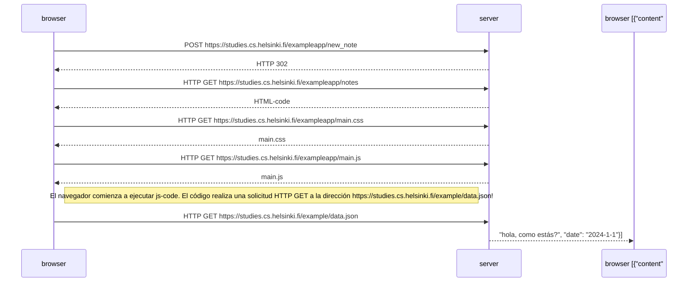

# part0

```mermaid
sequenceDiagram
browser->>server: POST https://studies.cs.helsinki.fi/exampleapp/new_note
server-->>browser: HTTP 302

browser->>server: HTTP GET https://studies.cs.helsinki.fi/exampleapp/notes
server-->>browser: HTML-code

browser->>server: HTTP GET https://studies.cs.helsinki.fi/exampleapp/main.css
server-->>browser: main.css

browser->>server: HTTP GET https://studies.cs.helsinki.fi/exampleapp/main.js
server-->>browser: main.js

Note right of browser: El navegador comienza a ejecutar js-code. El código realiza una solicitud HTTP GET a la dirección https://studies.cs.helsinki.fi/example/data.json!

browser->>server: HTTP GET https://studies.cs.helsinki.fi/example/data.json
server-->>browser [{"content":"hola, como estás?", "date": "2024-1-1"}]


```
