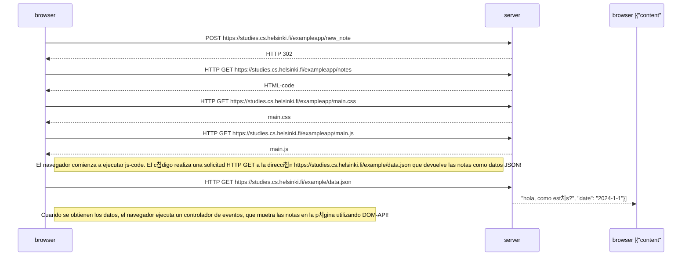

# part0

```mermaid
sequenceDiagram
browser->>server: POST https://studies.cs.helsinki.fi/exampleapp/new_note
server-->>browser: HTTP 302

browser->>server: HTTP GET https://studies.cs.helsinki.fi/exampleapp/notes
server-->>browser: HTML-code

browser->>server: HTTP GET https://studies.cs.helsinki.fi/exampleapp/main.css
server-->>browser: main.css

browser->>server: HTTP GET https://studies.cs.helsinki.fi/exampleapp/main.js
server-->>browser: main.js

Note right of browser: El navegador comienza a ejecutar js-code. El c칩digo realiza una solicitud HTTP GET a la direcci칩n https://studies.cs.helsinki.fi/example/data.json que devuelve las notas como datos JSON!

browser->>server: HTTP GET https://studies.cs.helsinki.fi/example/data.json
server-->>browser [{"content":"hola, como est치s?", "date": "2024-1-1"}]

Note right of browser: Cuando se obtienen los datos, el navegador ejecuta un controlador de eventos, que muetra las notas en la p치gina utilizando DOM-API!
```
